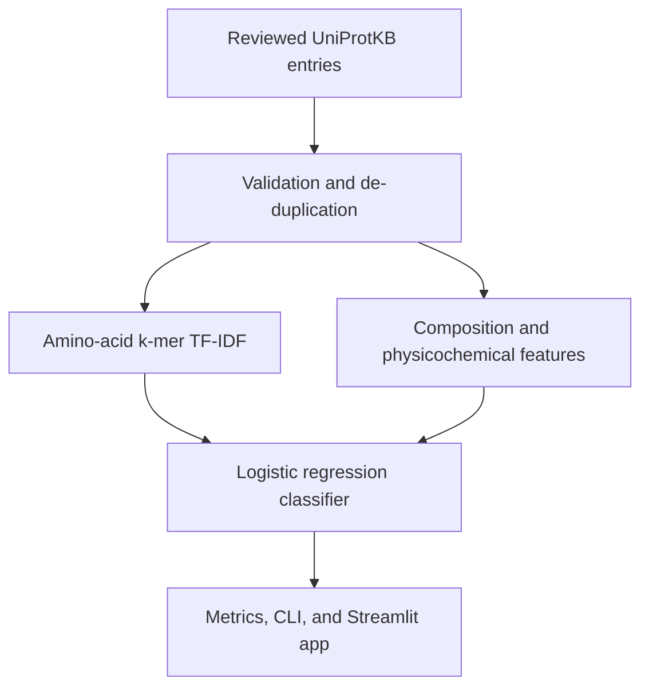

# ProtFunc ML

An end-to-end AI/ML project that predicts the **seven top-level Enzyme Commission (EC)
classes** directly from an amino-acid sequence. It includes automated UniProtKB data
collection, validation, feature engineering, model training, evaluation, command-line
inference, a Streamlit interface, tests, Docker support, and GitHub Actions CI.

> **Important:** This is a portfolio and educational baseline. A prediction is a
> hypothesis—not an experimental annotation. Do not use it for clinical, diagnostic,
> or safety-critical decisions.

## What it predicts

| Label | Function class | General role |
|---|---|---|
| `EC1_Oxidoreductase` | Oxidoreductase | Oxidation-reduction reactions |
| `EC2_Transferase` | Transferase | Functional-group transfer |
| `EC3_Hydrolase` | Hydrolase | Bond cleavage through hydrolysis |
| `EC4_Lyase` | Lyase | Non-hydrolytic addition/removal of groups |
| `EC5_Isomerase` | Isomerase | Intramolecular rearrangement |
| `EC6_Ligase` | Ligase | Joining molecules, usually using nucleotide energy |
| `EC7_Translocase` | Translocase | Movement across membranes |

## Architecture



The lightweight model trains on a normal CPU. Character 2–4-mer TF-IDF captures local
sequence motifs, while composition, length, entropy, charge, polarity, hydrophobicity,
and aromaticity provide global descriptors.

## Quick start

### 1. Create an environment

```bash
git clone https://github.com/YOUR_USERNAME/protein-function-predictor.git
cd protein-function-predictor
python -m venv .venv
```

Activate it:

```bash
# macOS/Linux
source .venv/bin/activate

# Windows PowerShell
.venv\Scripts\Activate.ps1
```

Install the project:

```bash
python -m pip install --upgrade pip
python -m pip install -e ".[app,dev]"
```

### 2. Download reviewed training data

```bash
protfunc fetch --output data/uniprot_ec.csv --per-class 500
```

This downloads up to 500 examples for each EC class through the official UniProt REST
API, samples deterministically, removes exact duplicates, and removes sequences that
receive conflicting top-level labels.

### 3. Train and evaluate

```bash
protfunc train \
  --data data/uniprot_ec.csv \
  --model models/protfunc.joblib \
  --reports-dir reports
```

Generated outputs:

- `models/protfunc.joblib` — versioned model artifact
- `reports/metrics.json` — accuracy, balanced accuracy, macro/weighted F1, top-k accuracy
- `reports/classification_report.json` — per-class precision, recall, and F1
- `reports/confusion_matrix.csv` — confusion matrix

### 4. Predict

Plain sequence:

```bash
protfunc predict --model models/protfunc.joblib --sequence "YOUR_AMINO_ACID_SEQUENCE"
```

FASTA file and JSON output:

```bash
protfunc predict --model models/protfunc.joblib --fasta proteins.fasta --top-k 3 --json
```

### 5. Launch the web app

```bash
streamlit run app.py
```

Open `http://localhost:8501`.

## Dataset format

Training accepts any CSV with at least these columns:

```csv
sequence,label
MSEQUENCE...,EC1_Oxidoreductase
MSEQUENCE...,EC3_Hydrolase
```

Allowed labels are listed in the table above. Sequences must be 20–10,000 residues and
use IUPAC amino-acid letters. Exact duplicates are de-duplicated. If the same sequence
has different labels, all conflicting rows for that sequence are removed.

## Evaluation caveat: homology leakage

The included baseline uses a reproducible, stratified random train/test split. Closely
related proteins can therefore appear in both sets, making performance look better than
it will be on genuinely novel protein families. For publication-grade work, cluster
sequences by identity (for example with MMseqs2 or CD-HIT), assign entire clusters to
one split, and report family-held-out performance. This limitation is also recorded in
every generated `metrics.json`.

## Tests and linting

```bash
python -m unittest discover -s tests -v
ruff check .
```

The GitHub Actions workflow runs linting and tests on Python 3.10 and 3.12.

## Docker

Train a model first so `models/protfunc.joblib` exists, then:

```bash
docker build -t protfunc-ml .
docker run --rm -p 8501:8501 -v "$(pwd)/models:/app/models:ro" protfunc-ml
```

## Repository structure

```text
protein-function-predictor/
├── .github/workflows/ci.yml
├── data/                 # downloaded dataset (ignored by Git)
├── docs/                 # model card and project report
├── models/               # trained artifacts (ignored by Git)
├── reports/              # evaluation outputs (ignored by Git)
├── src/protfunc/         # package source
├── tests/                # unit and end-to-end smoke tests
├── app.py                # Streamlit interface
├── Dockerfile
├── Makefile
└── pyproject.toml
```

## Reproducibility and data provenance

- Default random seed: `42`
- Source: reviewed UniProtKB entries with EC annotations
- Each row records its accession, original entry URL, and retrieval timestamp
- Generated data and model binaries are ignored to keep the repository small
- The trained artifact records the scikit-learn version and training configuration

UniProt documents its REST API, structured search, pagination, and output formats in
the [official API documentation](https://www.uniprot.org/api-documentation) and
[programmatic access guide](https://www.uniprot.org/help/programmatic_access).

## Security

Only load model files that you created or trust. `joblib` uses pickle-compatible
deserialization and an untrusted model file may execute code. See [SECURITY.md](SECURITY.md).

## License

Project code is released under the [MIT License](LICENSE). UniProt data has its own
[terms and licence information](https://www.uniprot.org/help/license).
